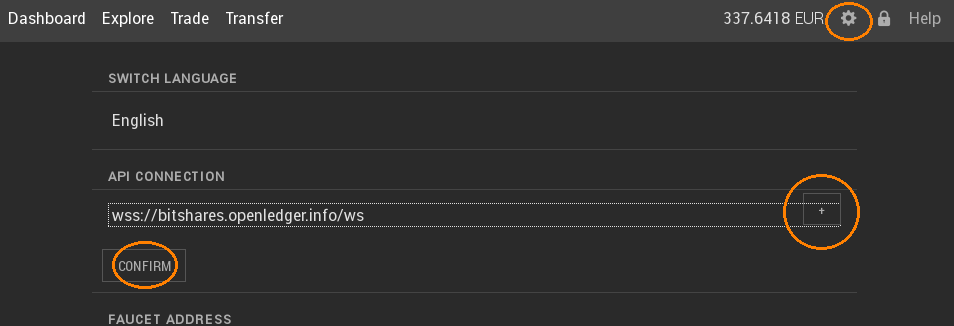

# Interacting with a GUI
### Prerequisites
* We assume  you have the `witness_node` already compliled (or downloaded from [the offical respository](https://github.com/bitshares/bitshares-2/releases/latest)).

* We assume you have downloaded and installed the light client GUI, i.e. `BitShares-light_2.0.XXXXXX`. The installation package is available in [the offical respository](https://github.com/bitshares/bitshares-2/releases/latest).

### Run the witness node
To run the witness node use this command:
```
witness_node --rpc-endpoint 127.0.0.1:11011
```

### Run the Light Client GUI
Start the application and then: 
* navigate to settings 
* add a new API connection: `ws://localhost:11011`
* select this connection on the drop-down list
* hit `CONFIRM` to apply this new connection



You are now connected to the network via your own full node.

